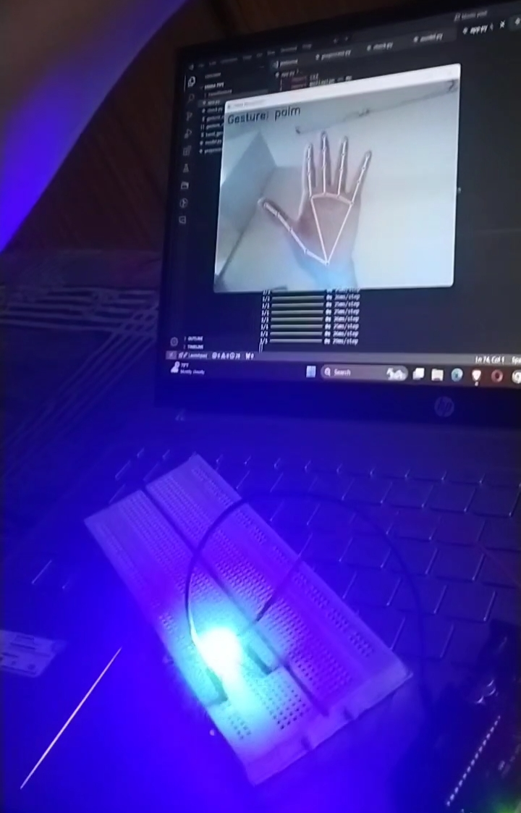
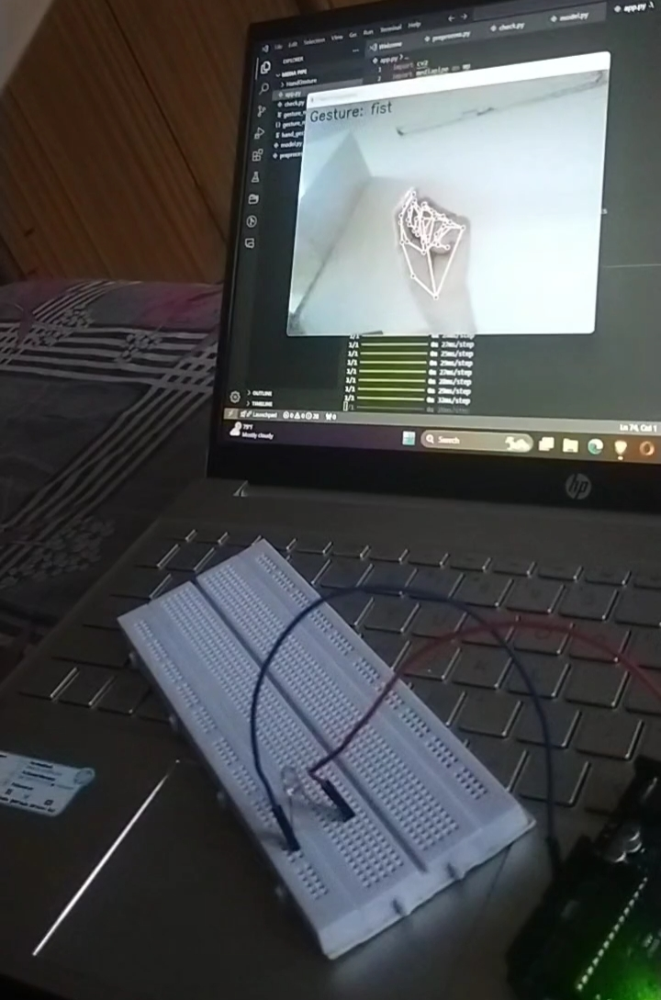

# LED Control using Hand Gesture

Controlled LED lights using hand gesture, Utilizing Tensorflow, Mediapipe, and Arduino.

## Overview

This project demonstrates how to control LED lights using hand gestures. By leveraging Tensorflow, Mediapipe, and Arduino, we created a system that detects specific hand gestures and triggers corresponding LED responses.

## Table of Contents

1. [Overview](#overview)
2. [Features](#features)
3. [Applications](#applications)
4. [Installation](#installation)
5. [Usage](#usage)
6. [Contributing](#contributing)
7. [License](#license)
8. [Acknowledgements](#acknowledgements)

## Features

- Real-time hand gesture recognition
- Control LEDs using predefined gestures
- Easy setup with Arduino and Python
- Scalable for more complex projects

## Applications

This project can be used in various applications, including but not limited to:

- **Home Automation**: Control home lighting systems with hand gestures.
- **Assistive Technology**: Provide an accessible interface for individuals with mobility impairments.
- **Interactive Displays**: Use hand gestures to control interactive installations in museums or exhibitions.
- **Robotics**: Integrate with robots to control actions based on hand gestures.

## Installation

### Prerequisites

- Arduino board
- LED lights
- Python 3.x
- Tensorflow
- Mediapipe
- OpenCV
- PyFirmata

### Images

